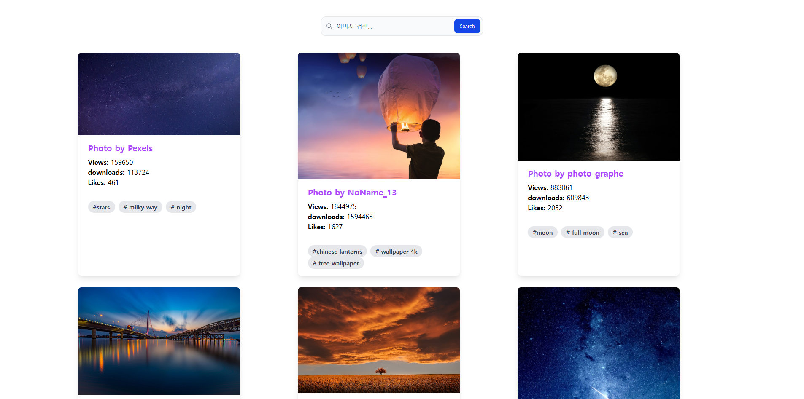

# 이미지 검색 갤러리 (React)

외부 이미지 API를 사용해 원하는 키워드로 사진을 검색하고, 카드 형태로 보여주는 리액트 프로젝트입니다.  
카드에는 이미지, 작성자, 조회수(Views), 다운로드 수(downloads), 좋아요 수(Likes), 태그가 표시됩니다.

## 주요 기능

- 검색창에 키워드를 입력하면 외부 이미지 API에서 데이터 호출
- 그리드 레이아웃으로 카드 정렬 (반응형 2~3열 배치)
- 카드 내에 작성자명, 조회수, 다운로드 수, 좋아요 수, 태그 표시
- 심플한 그림자·라운드 스타일의 카드 UI

## 사용 기술

- React (Vite 기반)
- JavaScript (ES6+)
- CSS (Flexbox / Grid)
- 외부 이미지 API (Unsplash 사용)

## 데모 화면

## 화면 링크
https://imagegalley-lemonsatang.netlify.app/